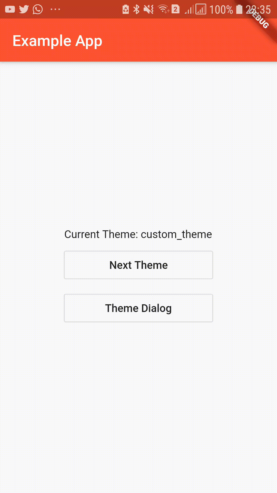

# theme_provider

[](https://codemagic.io/apps/5cfb60390824820019d5af6b/5cfb60390824820019d5af6a/latest_build)
[](https://pub.dartlang.org/packages/theme_provider)

Easy to use, customizable Theme Provider.
**This is still a work in progress.**

| Basic Usage           | Dialog Box           |
|:-------------:|:-------------:|
|  |  |

## Include in your project

```yaml
dependencies:
  theme_provider: ^0.1.0
```

run packages get and import it

```dart
import 'package:theme_provider/theme_provider.dart';
```

## Usage

Wrap your material app like this:

```dart
class MyApp extends StatelessWidget {
  @override
  Widget build(BuildContext context) {
    return ThemeProvider(
      builder: (theme) => MaterialApp(
        home: HomePage(),
        theme: theme,
      ),
    );
  }
}
```

Provide additional themes like this:

```dart
class MyApp extends StatelessWidget {
  @override
  Widget build(BuildContext context) {
    return ThemeProvider(
      themes: [
        AppTheme.light(), // This is standard light theme
        AppTheme.dark(), // This is standard dark theme
        AppTheme(
          id: "custom_theme", // Id (or name) of the theme(Has to be unique)
          data: ThemeData(
            primaryColor: Colors.black,
            accentColor: Colors.red,
          ),
        ),
      ],
      builder: (theme) => MaterialApp(
        home: HomePage(),
        theme: theme,
      ),
    );
  }
}
```

To change the theme:

```dart
 ThemeProvider.controllerOf(context).nextTheme();
 // Or
 ThemeProvider.controllerOf(context).setTheme(THEME_ID);
```

Access current `AppTheme`

```dart
 ThemeProvider.themeOf(context)
```

Access theme data:

```dart
 ThemeProvider.themeOf(context).data
 // or
 Theme.of(context)
```

### Passing Additional Options

This can also be used to pass additional data associated with the theme. Use `options` to pass additional data that should be associated with the theme.
eg: If font color on a specific button changes create a class to encapsulate the value.

```dart
  class ThemeOptions{
    final Color specificButtonColor;
    ThemeOptions(this.specificButtonColor);
  }
```

  Then provide the options with the theme.

  ```dart
class MyApp extends StatelessWidget {
  @override
  Widget build(BuildContext context) {
    return ThemeProvider(
      themes: themes: [
          AppTheme<ThemeOptions>(
              data: ThemeData.light(),
              options: ThemeOptions(Colors.blue),
          ),
          AppTheme<ThemeOptions>(
              data: ThemeData.dark(),
              options: ThemeOptions(Colors.red),
          ),
        ],
        builder: (theme) => MaterialApp(
          home: HomePage(),
          theme: theme,
        ),
    );
  }
}
  ```

Then the option can be retrieved as,

```dart
ThemeProvider.optionsOf<ThemeOptions>(context).specificButtonColor
```

## Persisting theme

### Saving theme

To persist themes simply pass `saveThemesOnChange` as `true`.
This will ensure that the theme is saved to the disk.

### Loading saved theme

`defaultThemeId` will be used to determine the initial theme.
But you can load thee previous theme by using:

```dart
 ThemeProvider.controllerOf(context).loadThemeFromDisk();
```

**Warning: Loading from disk will cause your app to be refreshed(which may cause a flicker)**
So it is recommended that if you use this feature, show a splash screen or use a theme agnostic startup screen
so the refreshing won't be visible to the user.

Example: Login screen may be designed so that it looks same in all screens.
So when the theme loads, it won't be noticeable to the user.
Then other screens can be themed.

## Additional Widgets

### Theme Cycle Widget

`IconButton` to be added to `AppBar` to cycle to next theme.

```dart
Scaffold(
  appBar: AppBar(
    title: Text("Example App"),
    actions: [CycleThemeIconButton()]
  ),
),
```

### Theme Selecting Dialog

`SimpleDialog` to let the user select the theme.
Many elements in this dialog is customizable.

```dart
showDialog(context: context, builder: (_) => ThemeDialog())
```

## TODO

- [x] Add next theme command
- [x] Add theme cycling widget
- [x] Add theme selection by theme id
- [x] Add theme select and preview widget
- [x] Persist current selected theme
- [x] Add unit tests and example
- [x] Remove provider dependency
- [ ] Add widget - theme selector grid
- [ ] Add dark mode support and automatic mode switch
- [ ] Ids for theme_prociders to allow multiple theme providers
- [ ] Add example to demostrate persistence

## Getting Started

For help getting started with Flutter, view our online [documentation](https://flutter.io/).

For help on editing package code, view the [documentation](https://flutter.io/developing-packages/).
